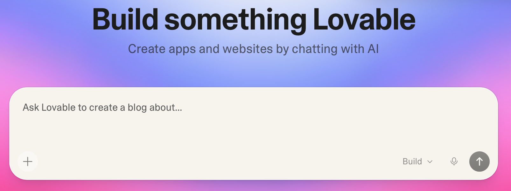
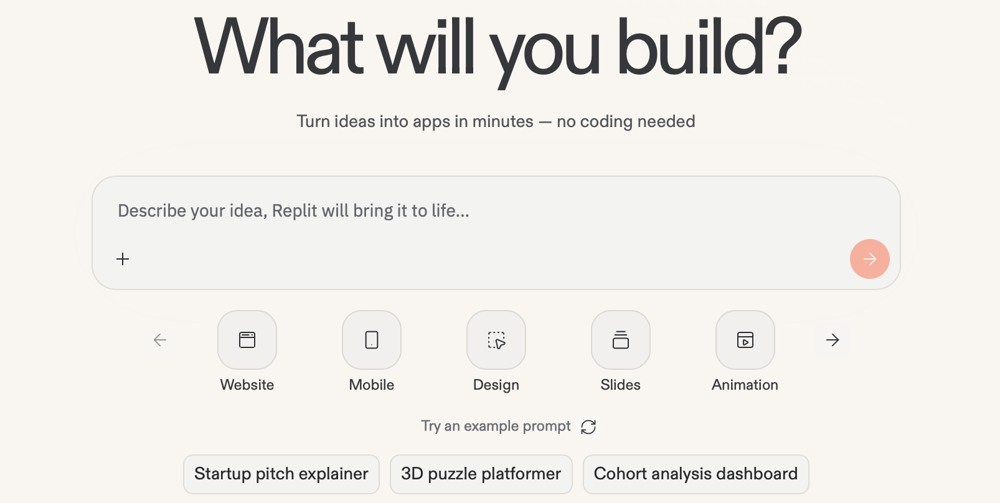
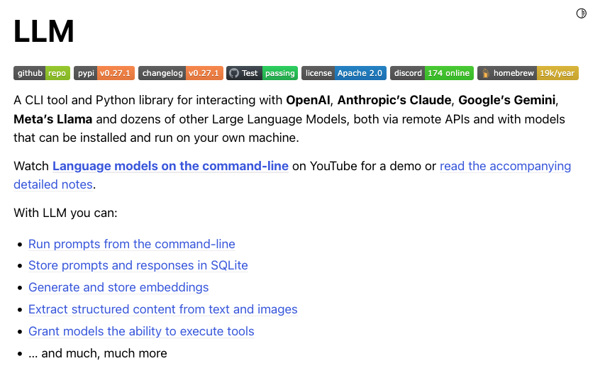

## Part 1: Tooling

---
layout: center
---

# Group discussion

<div style="font-size: 1.5em; margin-top: 0.5em;">How do <strong>you</strong> use AI in your coding workflow?</div>

---

# Interacting with LLMs

1. ChatGPT web interface / app
2. IDE autocomplete - e.g. GitHub Copilot in VSCode
3. Agents

    a. Human-in-the-loop coding agents - e.g. Claude Code, Codex, OpenCode

    b. Fully autonomous agents - e.g. OpenClaw

4. Agent instructions and skills files - e.g. `AGENTS.md`, `AGENT.md`, `CLAUDE.md`
5. Web-based tools - e.g. Lovable, Replit (Vibe coding apps using natural language)
6. API usage - e.g. OpenAI API, llm.datasette.io

---

# 1. ChatGPT App / Web Interface

- Choice of models!
  - Models are constantly being released
  - Tiers constantly changing
  - How do you decide which one to choose?

---

# 2. IDE autocomplete

- LLMs are used via installed extensions e.g. GitHub Copilot
  - Model can be changed
  - Best known for inline autocomplete / code completion
  - Different data privacy rules apply when interacting via this interface

- Other IDEs also available

---

# 3 a. Human-in-the-loop coding agents

- User stays in the loop while the agent explores, edits and runs tools
  - Can access other files and run tools on the operating system
  - Can find context automatically
  - Good for iterative coding with review and steerability

- Example tools: Claude Code, Codex CLI, OpenCode

---

# 3 b. Fully autonomous agents

- Agent works with minimal live supervision once given a task
  - Better for longer-running or delegated pieces of work
  - Often used asynchronously, sometimes in remote sandboxes/containers
  - Higher utility (possibly), but also much greater need for guardrails and review
  - Often sold as 'your personal AI assistant'

- Example: OpenClaw (and NemoClaw), Cowork

---

# 4. Web-based Agentic Tools

- Allow creation of full-stack web applications through natural language prompts
- Often described as "Vibe coding"
- "No coding experience needed"

<div style="display: grid; grid-template-columns: 1fr 1fr; gap: 2em; margin-top: 5em;">
  <div style="display: flex; flex-direction: column; align-items: center;">
    
    <div style="font-size: 0.75em; color: #6b7280; margin-top: 0.5em;">https://lovable.dev/</div>
  </div>
  <div style="display: flex; flex-direction: column; align-items: center;">
    
    <div style="font-size: 0.75em; color: #6b7280; margin-top: 0.5em;">https://replit.com/</div>
  </div>
</div>

---
layout: two-cols
---

# 5. Interacting via APIs

- Interaction with LLMs running remotely or locally via network protocols
- Bespoke applications can be written to make use of models
- Structured data can be fed to models programmatically
- Allows for batch processing of requests to increase performance
- Easy switching between models using common protocols
- Tools available e.g. Simon Willison's LLM Tool

::right::

<div style="display: flex; flex-direction: column; justify-content: center; height: 100%; text-align: center;">
  
  <div style="font-size: 0.75em; color: #6b7280; margin-top: 8px;">https://llm.datasette.io</div>
</div>

---

# Selecting a Model

<v-switch at="0">
<template #0>

- Different models for different purposes
  - **Standard**
  - Thinking / reasoning
  - Pro

</template>

<template #1>

- Different models for different purposes
  - ~~Standard~~ **Instant**
  - ~~Thinking / reasoning~~
  - ~~Pro~~ **Flagship**

</template>

<template #2>

- Different models for different purposes
  - ~~Standard~~ ~~Instant~~ **Instant / Fast**
  - ~~Thinking / reasoning~~ **Thinking**
  - ~~Pro~~ ~~Flagship~~ **Pro**

</template>
</v-switch>

- Different additional context/modes
  - Web search
  - Deep research - Gemini, Perplexity
  - Study & learn

---

# Prompt Engineering

- The PARTS framework from Google

| Element | What it means | Why it matters |
|---------|---------------|----------------|
| **P: Persona** | Set Gemini's role | Helps Gemini respond with the right tone, expertise, and behaviour (for example, "Act like a coach", "Act like an educator", or "Act like an instructional designer") |
| **A: Act** | Ask clearly for the task | Uses action words like create, rewrite, explain, or align to get specific results |
| **R: Recipient** | Say who it's for | Helps tailor output to the student group, staff, or community members |
| **T: Theme** | Add your topic or concept | Guides the content with context like "early literacy," "DNA structure," or "social-emotional learning" |
| **S: Structure** | Name the format or model you want | Helps Gemini tailor its output into specific formats like lesson plans, rubrics, slides, newsletters, or instructional frameworks (for example, 5E, UDL) |

<style>
table {
  font-size: 0.72em;
  width: 90%;
  margin: 3em auto 0;
}
th, td {
  padding: 4px 8px;
}
th:first-child, td:first-child {
  white-space: nowrap;
}
</style>

---
layout: center
---

# Prompt example

<div style="font-style: italic; font-size: 1.25em; line-height: 1.8; max-width: 42em; margin: 0 auto;">
<span :style="{ background: $clicks >= 1 ? '#EEDD88' : 'transparent', transition: 'background-color 0.3s' }">Act as a senior software developer.</span> <span :style="{ background: $clicks >= 1 ? '#99DDFF' : 'transparent', transition: 'background-color 0.3s' }">Show me how to write a simple</span> <span :style="{ background: $clicks >= 1 ? '#EE8866' : 'transparent', transition: 'background-color 0.3s' }">Python</span> <span :style="{ background: $clicks >= 1 ? '#44BB99' : 'transparent', transition: 'background-color 0.3s' }">function</span> <span :style="{ background: $clicks >= 1 ? '#99DDFF' : 'transparent', transition: 'background-color 0.3s' }">that takes a list of numbers and returns the average. Please explain each part of the code, especially how to handle potential errors like an empty list.</span> <span :style="{ background: $clicks >= 1 ? '#FFAABB' : 'transparent', transition: 'background-color 0.3s' }">I'm a high school student in an introductory programming course.</span>
</div>

<div v-click style="display: flex; justify-content: center; gap: 1.5em; margin-top: 1em; font-size: 0.8em;">
  <span><span style="display: inline-block; width: 1em; height: 1em; background: #EEDD88; outline: 1px solid rgba(0,0,0,0.15); vertical-align: middle; margin-right: 0.3em;"></span>P: Persona</span>
  <span><span style="display: inline-block; width: 1em; height: 1em; background: #99DDFF; outline: 1px solid rgba(0,0,0,0.15); vertical-align: middle; margin-right: 0.3em;"></span>A: Act</span>
  <span><span style="display: inline-block; width: 1em; height: 1em; background: #FFAABB; outline: 1px solid rgba(0,0,0,0.15); vertical-align: middle; margin-right: 0.3em;"></span>R: Recipient</span>
  <span><span style="display: inline-block; width: 1em; height: 1em; background: #EE8866; outline: 1px solid rgba(0,0,0,0.15); vertical-align: middle; margin-right: 0.3em;"></span>T: Theme</span>
  <span><span style="display: inline-block; width: 1em; height: 1em; background: #44BB99; outline: 1px solid rgba(0,0,0,0.15); vertical-align: middle; margin-right: 0.3em;"></span>S: Structure</span>
</div>

---

# Prompt Engineering Tips

- Provide examples of expected output/behaviour

- Iterate and refine
  - Can use LLMs to generate/iterate on your prompts (meta-prompting)

- Ask for step-by-step reasoning (chain-of-thought)

- Break down complex tasks into smaller and linked prompts (prompt chaining)

---

# Context Engineering

- LLMs have a limited working memory - <span v-mark.circle.orange="1">Context</span>

- Context engineering is the design and management of information given to the model to ensure it can perform a task correctly

- Builds upon prompt engineering by creating an entire information ecosystem

- Active area of research!

- Auto-context with agents


---

# Context Engineering: Agent Instructions and Skills Files

- Extra context files can shape how an agent works in a codebase
  - Project instructions: `AGENTS.md`, `CLAUDE.md`
  - Skills files can bundle reusable workflows, commands and domain knowledge

- Useful for encoding team conventions, guardrails and common tasks

- These make agent behaviour more repeatable than relying on a one-off prompt

- WARNING: can open you to supply chain attacks


---
layout: two-cols
---

# Context Engineering: Meaningful names provide context

<div class="pr-3">

Providing the function signature:

```python
def convert(x):
```

Produces the output:

```python
def convert(x):
  if isinstance(x, str):
    return x.upper()
  elif isinstance(x, int):
    return x * 2
  elif isinstance(x, list):
    return [convert(i) for i in x]
  else:
    return None
```

</div>

::right::

<div class="pl-3">

Whereas providing:

```python
def celsius_to_fahrenheit(celsius):
```

Produces:

```python
def celsius_to_fahrenheit(celsius):
    """Convert Celsius to Fahrenheit."""
    return (celsius * 9/5) + 32
```
</div>

---
layout: two-cols
---

# Context can be a constraint

<div class="pr-3">

Providing the function signature:

```python
def levenshtein(a, b):
```

Produces the output:

```python {*}{maxHeight:'260px'}
def levenshtein(a, b):
    """Compute the Levenshtein distance between two strings."""
    if len(a) < len(b):
        return levenshtein(b, a)

    if len(b) == 0:
        return len(a)

    previous_row = range(len(b) + 1)
    for i, c1 in enumerate(a):
        current_row = [i + 1]
        for j, c2 in enumerate(b):
            insertions = previous_row[j + 1] + 1
            deletions = current_row[j] + 1
            substitutions = previous_row[j] + (c1 != c2)
            current_row.append(min(insertions, deletions, substitutions))
        previous_row = current_row

    return previous_row[-1]
```

</div>

::right::

<div class="pl-3">

Whereas providing:

```python
from Levenshtein import distance

def levenshtein(a, b):
```

Produces:

```python
def levenshtein(a, b):
    return distance(a, b)
```

<br />

In the first case, AI reinvented the algorithm because it is constrained to the script context.

</div>

---
layout: two-cols
---

# Options available for Oxford-based software engineers

<v-clicks>

- OpenAI accounts for all staff and students
  - ChatGPT, Codex (desktop, web, CLI)
- Gemini accounts for all staff and students
  - Gemini web chat, Gemini CLI, Antigravity?
- GitHub Copilot Edu for all staff and students
  - On GitHub, in VS Code 
  - Currently allows you to use other models (Gemini, Codex, Claude) but this will change
- Access to other harnesses i.e. OpenCode
  - Can connect Copilot + Codex but not Gemini (needs API key)
- No official access to Anthropic models (not allowed to use on Oxford data)

</v-clicks>

::right::

<div v-click="6" style="margin-top: 5em; padding: 1em 1.25em; border: 2px solid #2563eb; border-radius: 0.75em; background: #eff6ff; color: #1d4ed8; font-weight: 700; line-height: 1.4;">
  Usage limits and options are tightening across the board
</div>

---

# Exercise

- <https://github.com/OxfordRSE/interactive-plotting-exercise>
- Carbon Intensity API

<div style="margin: 2em auto 0; width: 55%; padding: 2em; border-radius: 1em; background: #0097A7; color: white; text-align: center;">
  <div style="font-size: 2em; font-weight: bold; margin-bottom: 0.5em;">Exercise</div>
  <div style="font-size: 1em;">Build a Python application that interactively plots regional carbon intensity data, from the UK Carbon Intensity API, onto a map of the UK.</div>
</div>
