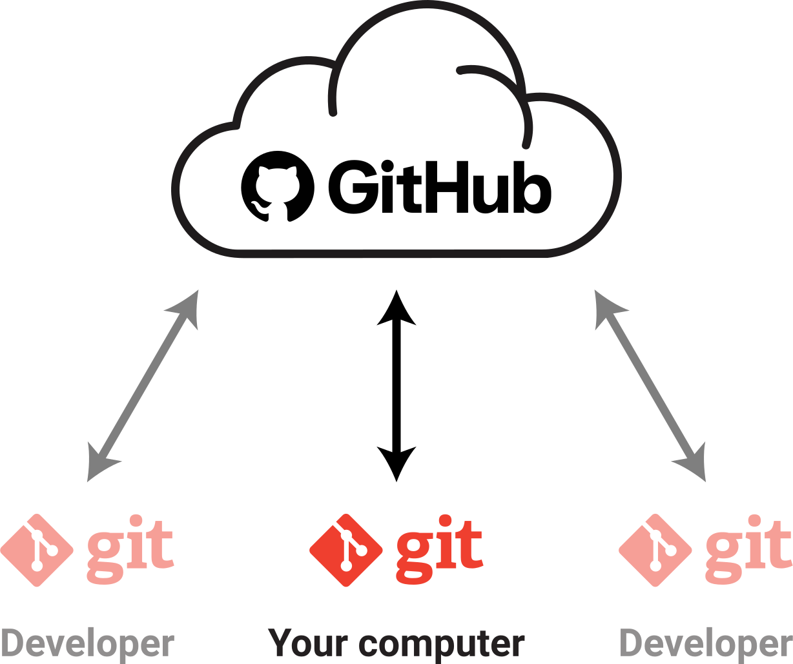
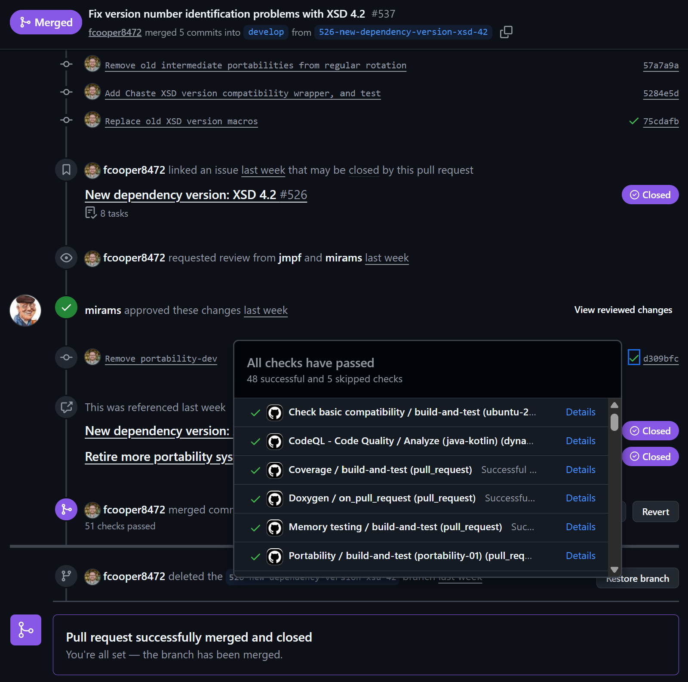
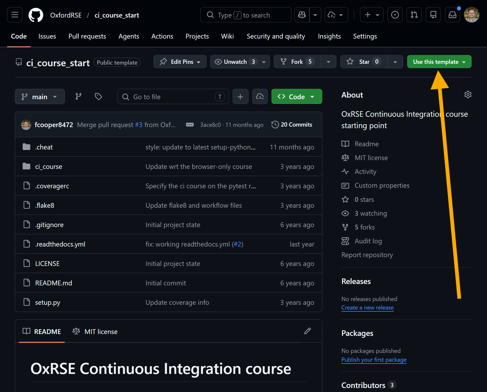

# Introduction to Continuous Integration (CI)

<v-clicks>

- **Continuous Integration (CI)** is an automated process for verifying and integrating code changes
- Objective: detect and resolve issues early by frequently testing and integrating code changes
- Helps ensure **compatibility**, **functionality**, and reduces unexpected problems

</v-clicks>

<style>
    ul { @apply flex flex-col h-100 justify-evenly text-xl }
</style>

---
layout: two-cols
---

# Challenges without CI

<v-clicks>

- **Compatibility**: ensuring code works across different operating systems, software versions, and hardware
- **Consistency**: avoiding hidden dependencies on user data or machine-specific configuration
- **Collaboration**: managing code changes from multiple developers without conflict

</v-clicks>

<style>
    ul { @apply flex flex-col h-100 justify-evenly text-xl }
</style>

::right::
<div class="pl-4 pt-8">
  <p class="mb-3 text-sm font-semibold tracking-wide text-gray-600">
    Same codebase, different outcomes across platforms
  </p>
  <table class="w-full text-base border-separate border-spacing-1">
    <thead>
      <tr class="text-white">
        <th class="bg-gray-500 p-2"></th>
        <th class="bg-gray-500 p-2 font-semibold">Ubuntu</th>
        <th class="bg-gray-500 p-2 font-semibold">Windows</th>
        <th class="bg-gray-500 p-2 font-semibold">MacOS</th>
      </tr>
    </thead>
    <tbody>
      <tr>
        <td class="bg-gray-200 p-2 text-left">Python 3.14</td>
        <td class="bg-gray-200 p-2 text-center text-green-500 text-2xl">&#10003;</td>
        <td class="bg-gray-200 p-2 text-center text-pink-500 text-2xl">&#10007;</td>
        <td class="bg-gray-200 p-2 text-center text-green-500 text-2xl">&#10003;</td>
      </tr>
      <tr>
        <td class="bg-gray-100 p-2 text-left">Python 3.13</td>
        <td class="bg-gray-100 p-2 text-center text-green-500 text-2xl">&#10003;</td>
        <td class="bg-gray-100 p-2 text-center text-green-500 text-2xl">&#10003;</td>
        <td class="bg-gray-100 p-2 text-center text-green-500 text-2xl">&#10003;</td>
      </tr>
      <tr>
        <td class="bg-gray-200 p-2 text-left">Python 3.12</td>
        <td class="bg-gray-200 p-2 text-center text-green-500 text-2xl">&#10003;</td>
        <td class="bg-gray-200 p-2 text-center text-green-500 text-2xl">&#10003;</td>
        <td class="bg-gray-200 p-2 text-center text-green-500 text-2xl">&#10003;</td>
      </tr>
      <tr>
        <td class="bg-gray-100 p-2 text-left">Python 3.10</td>
        <td class="bg-gray-100 p-2 text-center text-green-500 text-2xl">&#10003;</td>
        <td class="bg-gray-100 p-2 text-center text-green-500 text-2xl">&#10003;</td>
        <td class="bg-gray-100 p-2 text-center text-green-500 text-2xl">&#10003;</td>
      </tr>
    </tbody>
  </table>
</div>

---
layout: two-cols
---

# Key principles of CI

<v-clicks>

- **Single source repository**: keep code and dependencies in a shared repository
- **Automate the build**: compile, package, and create installers automatically
- **Self-testing builds**: run automated tests after each build to validate functionality

</v-clicks>

<style>
    ul { @apply flex flex-col h-100 justify-evenly text-xl }
</style>

::right::
<div class="pl-4 flex items-center justify-center h-full">
  
</div>

---
layout: two-cols
---

# Key principles of CI (continued)


<div class="h-full flex items-center justify-left">
  
</div>

::right::

<v-clicks>

- **Frequent commits**: integrate changes regularly to avoid complex merge conflicts
- **Integration machine**: run builds and tests in a standardised, clean environment
- **Visibility and transparency**: make build and test results accessible to the whole team

</v-clicks>

<style>
    ul { @apply flex flex-col h-100 justify-evenly text-xl }
</style>


---

# Benefits of implementing CI

<v-clicks>

- **Efficiency**: integration issues are detected and resolved quickly
- **Quality assurance**: automated tests and builds improve code quality and reliability
- **Reproducibility**: standardised automated processes produce consistent results

</v-clicks>

<style>
    ul { @apply flex flex-col h-100 justify-evenly text-xl }
</style>

---

# Continuous Integration tools

<v-clicks>

<div class="flex items-center gap-4 py-2">
  
  <p class="m-0"><strong>GitHub Actions</strong>: CI/CD integrated into GitHub</p>
</div>

<div class="flex items-center gap-4 py-2">
  
  <p class="m-0"><strong>Travis CI</strong>: widely used CI service, especially in open-source projects</p>
</div>

<div class="flex items-center gap-4 py-2">
  
  <p class="m-0"><strong>AppVeyor</strong>: CI/CD platform for building, testing, and deploying applications</p>
</div>

<p class="pt-3">Each tool has both shared and unique features</p>

<p>Exploring multiple options is worthwhile</p>

</v-clicks>

<style>
    p { @apply text-xl }
</style>

---

# This course

### Hands-on setup of CI for a small **Python** project using **GitHub Actions**

<v-clicks>

- Introduction to **GitHub Actions**
- Generating **code coverage** information
- Creating and deploying **documentation**

</v-clicks>

<style>
    ul { @apply flex flex-col h-100 justify-evenly text-xl }
</style>

---
layout: two-cols
---

# Basic GitHub Actions

<div class="pr-4">

<ul class="space-y-3">
  <li v-click="1">Workflows are defined in YAML</li>
  <li v-click="2">
    Common triggers:
    <ul class="mt-2">
      <li><code>push</code></li>
      <li><code>pull_request</code></li>
      <li><code>workflow_dispatch</code></li>
    </ul>
  </li>
  <li v-click="3">Jobs run on specified runners such as <code>ubuntu-latest</code></li>
  <li v-click="4">Each job contains one or more <strong>steps</strong></li>
</ul>

</div>

::right::
<div class="pl-4 pt-6">

```yaml {1-13|1-13|3-6|8-10|11-13}
name: Hello World

on:
  push:
  pull_request:
  workflow_dispatch:

jobs:
  basic-job:
    runs-on: ubuntu-latest
    steps:
      - name: Run a one-line script
        run: echo "Hello, world!"
```

</div>

---
layout: two-cols
---

# Getting started with the course

<v-clicks>

- Visit the [**GitHub Template Repository**](https://github.com/OxfordRSE/ci_course_start)
- Click **Use this template** and create a new repository
- Name the repository
- Clone it to your local machine
- Continue to follow the course online for further instructions

</v-clicks>

<style>
    ul { @apply flex flex-col h-100 justify-evenly text-xl }
</style>

::right::

<div class="h-full flex items-center justify-right">
  
</div>
